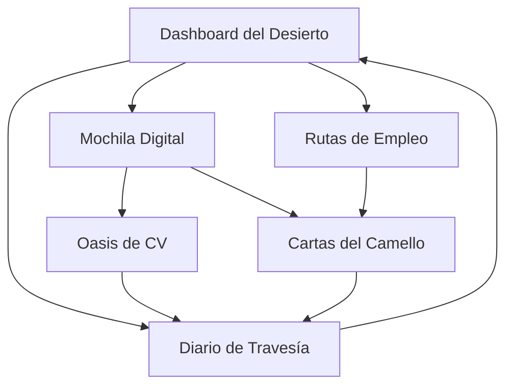

# BuscaCamello - Documento de Requerimientos del Producto

## 1. Resumen del Producto

BuscaCamello es una aplicación web React diseñada para optimizar y organizar la búsqueda de empleo de manera legal y efectiva. Como un camello resistente en el desierto laboral, la aplicación ayuda a los usuarios a navegar por el complejo proceso de búsqueda de trabajo sin violar términos de servicio de las plataformas de empleo.

La aplicación resuelve el problema de la desorganización en la búsqueda de empleo, proporcionando herramientas centralizadas para gestionar aplicaciones, datos personales y seguimiento de oportunidades laborales.

## 2. Funcionalidades Principales

### 2.1 Roles de Usuario

| Rol | Método de Registro | Permisos Principales |
|-----|-------------------|---------------------|
| Usuario Estándar | Registro directo en la aplicación | Acceso completo a todas las funcionalidades de gestión personal |

### 2.2 Módulos de Funcionalidades

Nuestra aplicación BuscaCamello consta de las siguientes páginas principales:

1. **Dashboard del Desierto**: centro de control principal, estadísticas de búsqueda, accesos rápidos a funcionalidades.
2. **Mochila Digital**: gestión de perfil personal, almacenamiento de CV, datos de contacto.
3. **Rutas de Empleo**: organizador de sitios web de empleo, enlaces directos, categorización por industria.
4. **Diario de Travesía**: tracker de aplicaciones enviadas, estados de seguimiento, notas personales.
5. **Cartas del Camello**: generador de cartas de presentación, plantillas personalizables, auto-completado.
6. **Oasis de CV**: generador de currículum adaptable, múltiples formatos, optimización por industria.

### 2.3 Detalles de Páginas

| Nombre de Página | Nombre del Módulo | Descripción de Funcionalidad |
|------------------|-------------------|------------------------------|
| Dashboard del Desierto | Panel de Estadísticas | Mostrar métricas de aplicaciones enviadas, respuestas recibidas, próximas tareas |
| Dashboard del Desierto | Accesos Rápidos | Botones de navegación rápida a funcionalidades principales |
| Dashboard del Desierto | Recordatorios | Sistema de notificaciones para seguimiento de aplicaciones |
| Mochila Digital | Perfil Personal | Formulario completo de datos personales con validación |
| Mochila Digital | Gestor de CV | Subir, editar y organizar múltiples versiones de currículum |
| Mochila Digital | Datos de Contacto | Gestión de información de contacto y redes sociales |
| Rutas de Empleo | Lista de Sitios | Catálogo organizado de sitios web de empleo populares |
| Rutas de Empleo | Enlaces Directos | Acceso directo a secciones específicas de búsqueda |
| Rutas de Empleo | Categorización | Filtros por industria, tipo de trabajo, ubicación |
| Diario de Travesía | Tracker de Aplicaciones | Registro detallado de aplicaciones con estados y fechas |
| Diario de Travesía | Sistema de Notas | Notas personales para cada aplicación y empresa |
| Diario de Travesía | Seguimiento | Recordatorios automáticos para hacer seguimiento |
| Cartas del Camello | Editor de Plantillas | Creador de cartas de presentación con plantillas predefinidas |
| Cartas del Camello | Auto-completado | Relleno automático con datos del perfil personal |
| Cartas del Camello | Personalización | Adaptación de cartas por empresa y posición |
| Oasis de CV | Generador de CV | Creación de currículum con múltiples formatos y estilos |
| Oasis de CV | Optimización | Sugerencias de mejora basadas en la industria objetivo |
| Oasis de CV | Exportación | Descarga en formatos PDF, Word y otros |

## 3. Proceso Principal

### Flujo del Usuario Estándar

1. **Configuración Inicial**: El usuario completa su perfil en la Mochila Digital, sube su CV base y configura sus datos de contacto.
2. **Exploración de Oportunidades**: Utiliza las Rutas de Empleo para acceder a sitios web organizados y buscar ofertas laborales.
3. **Aplicación Asistida**: Emplea las Cartas del Camello para generar cartas de presentación personalizadas y el Oasis de CV para adaptar su currículum.
4. **Registro y Seguimiento**: Documenta cada aplicación en el Diario de Travesía con detalles, fechas y notas.
5. **Monitoreo Continuo**: Revisa el Dashboard del Desierto para obtener una visión general de su progreso y próximas acciones.

## 4. Diseño de Interfaz de Usuario

### 4.1 Estilo de Diseño

- **Colores Primarios**: Tonos tierra y arena (#D4A574, #C4915C, #8B4513)
- **Colores Secundarios**: Azul oasis (#4A90E2, #2E5BBA) y verde cactus (#228B22)
- **Estilo de Botones**: Redondeados con efecto de elevación, inspirados en dunas
- **Tipografía**: Inter para textos principales, tamaños 14px-18px para contenido
- **Estilo de Layout**: Diseño de tarjetas con sombras suaves, navegación lateral tipo oasis
- **Iconografía**: Iconos de Lucide React con temática del desierto y viaje

### 4.2 Resumen de Diseño de Páginas

| Nombre de Página | Nombre del Módulo | Elementos de UI |
|------------------|-------------------|----------------|
| Dashboard del Desierto | Panel Principal | Tarjetas de estadísticas con iconos de camello, gráficos de progreso circulares, colores tierra |
| Mochila Digital | Formulario de Perfil | Campos de entrada con bordes redondeados, validación en tiempo real, botones tipo duna |
| Rutas de Empleo | Grid de Sitios | Tarjetas de sitios web con logos, botones de acceso directo, filtros laterales |
| Diario de Travesía | Tabla de Aplicaciones | Lista con estados coloridos, iconos de progreso, modal de detalles |
| Cartas del Camello | Editor de Texto | Editor WYSIWYG con barra de herramientas, vista previa en tiempo real |
| Oasis de CV | Constructor Visual | Interfaz drag-and-drop, plantillas predefinidas, vista previa PDF |

### 4.3 Responsividad

La aplicación está diseñada con enfoque mobile-first, adaptándose perfectamente a dispositivos móviles, tablets y escritorio. Incluye optimización táctil para una experiencia fluida en todos los dispositivos.