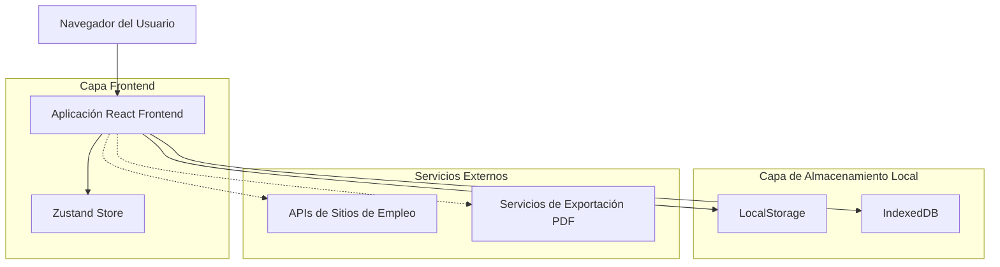
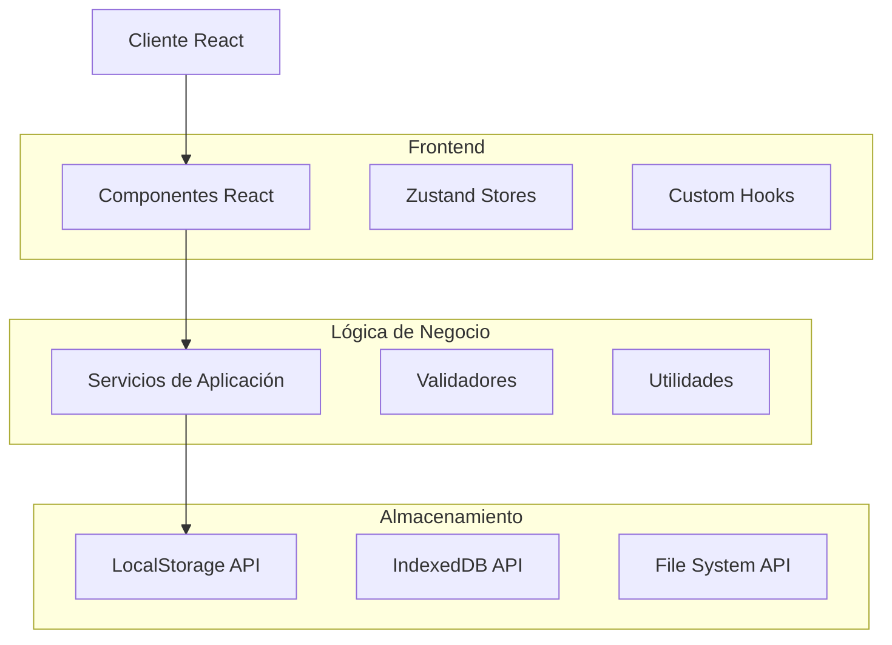
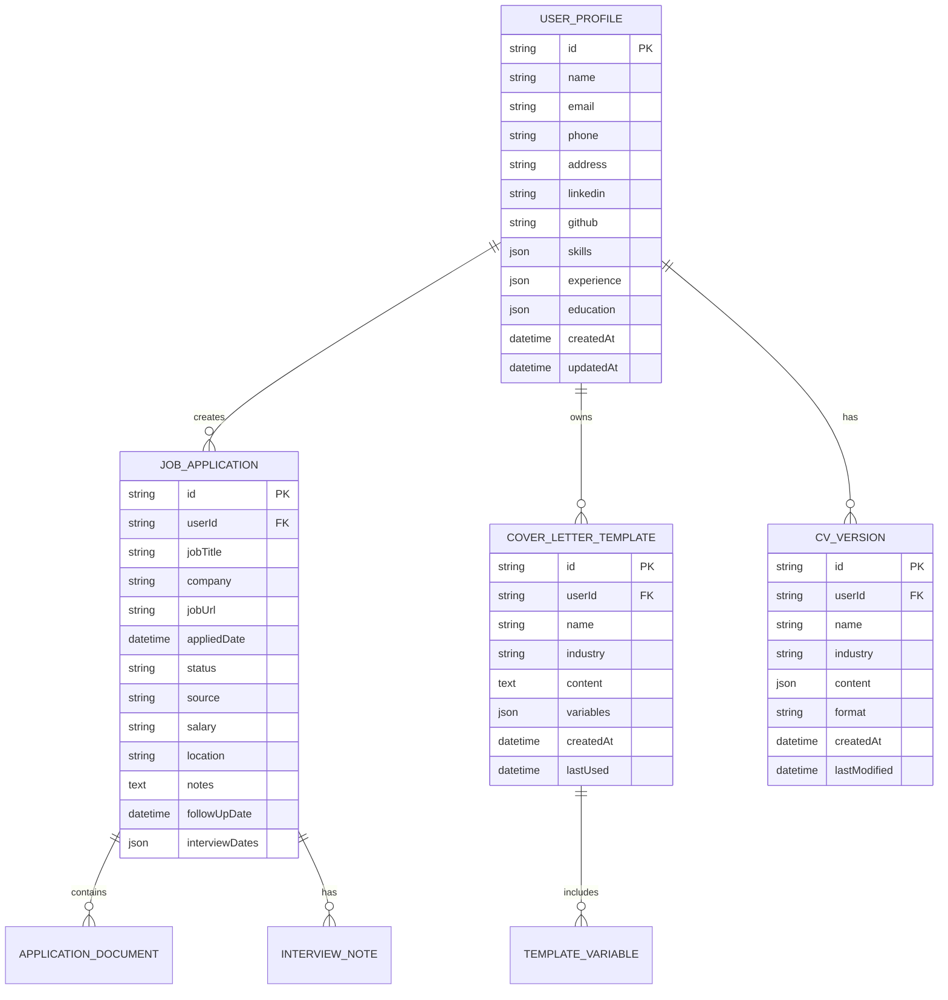

# BuscaCamello - Arquitectura Técnica

## 1. Diseño de Arquitectura



## 2. Descripción de Tecnologías

- **Frontend**: React@18 + TypeScript + Vite
- **Styling**: Tailwind CSS@3 + Shadcn/ui
- **Estado**: Zustand para gestión de estado global
- **Formularios**: React Hook Form + Zod para validación
- **Almacenamiento**: LocalStorage + IndexedDB para persistencia
- **Iconos**: Lucide React con temática del desierto
- **Utilidades**: date-fns para manejo de fechas, clsx para clases condicionales

## 3. Definiciones de Rutas

| Ruta | Propósito |
|------|----------|
| / | Dashboard principal - vista general de la búsqueda de empleo |
| /profile | Mochila Digital - gestión de perfil personal y datos |
| /sites | Rutas de Empleo - organizador de sitios web de trabajo |
| /applications | Diario de Travesía - tracker de aplicaciones enviadas |
| /letters | Cartas del Camello - generador de cartas de presentación |
| /cv-builder | Oasis de CV - constructor de currículum adaptable |
| /settings | Configuración general de la aplicación |

## 4. Definiciones de API

### 4.1 API Principal

**Gestión de Perfil de Usuario**
```typescript
// Tipos de datos principales
interface UserProfile {
  id: string;
  name: string;
  email: string;
  phone: string;
  address: string;
  linkedin?: string;
  github?: string;
  portfolio?: string;
  skills: string[];
  experience: WorkExperience[];
  education: Education[];
  createdAt: Date;
  updatedAt: Date;
}

interface WorkExperience {
  id: string;
  company: string;
  position: string;
  startDate: Date;
  endDate?: Date;
  description: string;
  skills: string[];
}

interface Education {
  id: string;
  institution: string;
  degree: string;
  field: string;
  startDate: Date;
  endDate?: Date;
  gpa?: number;
}
```

**Gestión de Aplicaciones**
```typescript
interface JobApplication {
  id: string;
  jobTitle: string;
  company: string;
  jobUrl: string;
  appliedDate: Date;
  status: ApplicationStatus;
  source: string; // LinkedIn, Indeed, etc.
  salary?: string;
  location: string;
  notes: string;
  followUpDate?: Date;
  interviewDates: Date[];
  documents: ApplicationDocument[];
}

type ApplicationStatus = 
  | 'applied'
  | 'under_review'
  | 'interview_scheduled'
  | 'interviewed'
  | 'rejected'
  | 'offer_received'
  | 'accepted';

interface ApplicationDocument {
  id: string;
  type: 'cv' | 'cover_letter' | 'portfolio';
  name: string;
  url: string;
  createdAt: Date;
}
```

**Plantillas de Cartas**
```typescript
interface CoverLetterTemplate {
  id: string;
  name: string;
  industry: string;
  content: string;
  variables: TemplateVariable[];
  createdAt: Date;
  lastUsed?: Date;
}

interface TemplateVariable {
  key: string;
  label: string;
  type: 'text' | 'date' | 'list';
  required: boolean;
  defaultValue?: string;
}
```

## 5. Arquitectura del Servidor



## 6. Modelo de Datos

### 6.1 Definición del Modelo de Datos



### 6.2 Lenguaje de Definición de Datos

**Almacenamiento LocalStorage**
```typescript
// Configuración de almacenamiento local
const STORAGE_KEYS = {
  USER_PROFILE: 'buscacamello_user_profile',
  APPLICATIONS: 'buscacamello_applications',
  TEMPLATES: 'buscacamello_templates',
  CV_VERSIONS: 'buscacamello_cv_versions',
  SETTINGS: 'buscacamello_settings'
} as const;

// Inicialización de datos por defecto
const DEFAULT_PROFILE: Partial<UserProfile> = {
  skills: [],
  experience: [],
  education: [],
  createdAt: new Date(),
  updatedAt: new Date()
};

const DEFAULT_SETTINGS = {
  theme: 'desert',
  language: 'es',
  notifications: true,
  autoSave: true,
  reminderDays: 7
};
```

**Configuración IndexedDB**
```typescript
// Configuración de base de datos IndexedDB
const DB_CONFIG = {
  name: 'BuscaCamelloDB',
  version: 1,
  stores: {
    applications: {
      keyPath: 'id',
      indexes: [
        { name: 'company', keyPath: 'company' },
        { name: 'status', keyPath: 'status' },
        { name: 'appliedDate', keyPath: 'appliedDate' },
        { name: 'followUpDate', keyPath: 'followUpDate' }
      ]
    },
    documents: {
      keyPath: 'id',
      indexes: [
        { name: 'applicationId', keyPath: 'applicationId' },
        { name: 'type', keyPath: 'type' }
      ]
    },
    templates: {
      keyPath: 'id',
      indexes: [
        { name: 'industry', keyPath: 'industry' },
        { name: 'lastUsed', keyPath: 'lastUsed' }
      ]
    }
  }
};
```

**Datos de Inicialización**
```typescript
// Sitios de empleo predefinidos
const JOB_SITES = [
  {
    id: 'linkedin',
    name: 'LinkedIn',
    url: 'https://www.linkedin.com/jobs/',
    category: 'professional',
    logo: '/logos/linkedin.svg',
    description: 'Red profesional líder mundial'
  },
  {
    id: 'indeed',
    name: 'Indeed',
    url: 'https://www.indeed.com/',
    category: 'general',
    logo: '/logos/indeed.svg',
    description: 'Motor de búsqueda de empleos'
  },
  {
    id: 'computrabajo',
    name: 'Computrabajo',
    url: 'https://www.computrabajo.com/',
    category: 'latam',
    logo: '/logos/computrabajo.svg',
    description: 'Portal de empleos de Latinoamérica'
  }
];

// Plantillas de cartas predefinidas
const DEFAULT_TEMPLATES = [
  {
    id: 'tech-general',
    name: 'Tecnología - General',
    industry: 'technology',
    content: `Estimado/a {{hiring_manager}},\n\nMe dirijo a usted para expresar mi interés en la posición de {{job_title}} en {{company_name}}...`
  }
];
```